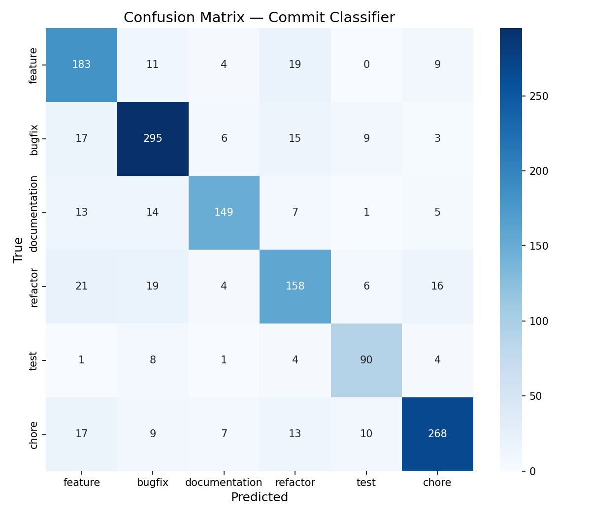

# Smart Changelog Generator

Eine NLP-Pipeline, die automatisch strukturierte, kategorisierte und zusammengefasste Changelogs aus GitHub-Commits generiert — für beliebige Repositories, ohne manuelle Konfiguration.

> Bachelormodul-Projekt für **Natural Language Processing** — WiSe 25/26

---

## Funktionsweise

```
GitHub API  →  Commit-Klassifikator (Sentence-BERT)  →  GPT-4o-mini Summarizer  →  Markdown-Changelog
                          ↑
               Trainiert auf gelabelten Commits
               (gelabelt via GPT-4o-mini)
```

Commits werden aus einem beliebigen GitHub-Repository abgerufen, von einem trainierten NLP-Modell in eine von sechs Kategorien klassifiziert und anschließend pro Kategorie durch GPT-4o-mini in prägnante Bullet-Points zusammengefasst.

### Commit-Kategorien

| Kategorie | Beschreibung |
|---|---|
| `feature` | Neue Funktionalität oder Features |
| `bugfix` | Fehlerbehebungen und Korrekturen |
| `documentation` | Dokumentation, README, Kommentare |
| `refactor` | Code-Umstrukturierung ohne Verhaltensänderung |
| `test` | Hinzufügen oder Anpassen von Tests |
| `chore` | Build, CI/CD, Abhängigkeiten, Tooling |

---

## Voraussetzungen

- Python 3.11+
- OpenAI API Key
- GitHub Token (optional, aber empfohlen für höhere Rate-Limits und private Repositories)

---

## Setup

### 1. Abhängigkeiten installieren

```bash
pip install -r requirements.txt
```

### 2. Umgebungsvariablen konfigurieren

```bash
cp .env.example .env
```

`.env` öffnen und die API-Keys eintragen:

```
OPENAI_API_KEY=dein_openai_api_key
GITHUB_TOKEN=dein_github_token
```

Der `GITHUB_TOKEN` ist optional — ohne Token ist die GitHub API auf 60 Anfragen pro Stunde begrenzt, mit Token auf 5.000 Anfragen pro Stunde. Für private Repositories ist ein Token erforderlich.

---

## Schnellstart

Nach dem Setup müssen folgende Schritte **einmalig** in dieser Reihenfolge ausgeführt werden, bevor die Webanwendung genutzt werden kann:

**1. Modell trainieren** (Trainingsdaten liegen bereits vor):
```bash
python -m ml.train_bert
```

**2. Webanwendung starten:**
```bash
uvicorn app.main:app --reload
```

Das trainierte Modell wird unter `models/` gespeichert und beim Start der Webanwendung automatisch geladen.

---

## Webanwendung starten

```bash
uvicorn app.main:app --reload
```

Anschließend im Browser [http://localhost:8000](http://localhost:8000) öffnen.

### Verwendung

1. GitHub-Repository-URL eingeben (z.B. `https://github.com/pallets/flask`)
2. Optional: GitHub-Token eingeben (erforderlich für private Repositories)
3. Zeitraum **oder** Anzahl der letzten Commits auswählen
4. Ausgabesprache wählen
5. **Generate Changelog** klicken

Der generierte Changelog wird als gerendertes Markdown im Browser angezeigt und kann als `.md`-Datei heruntergeladen werden.

Über den Button **Model Evaluation** am unteren Rand der Oberfläche lässt sich die Klassifikator-Evaluation direkt im Browser starten.

---

## NLP-Trainingspipeline

> **Hinweis:** Die Trainingsdaten wurden bereits am 15.03.2026 um 20:15 Uhr gepullt und gelabelt und liegen unter `data/labeled/commits_labeled.jsonl`. Für den normalen Betrieb reicht es, **nur Schritt 2 (Training)** auszuführen. Schritt 1 (Datenbeschaffung) muss nur wiederholt werden, wenn neue oder aktuellere Trainingsdaten benötigt werden.

> **Aktuelle Modellperformance** (Stand: 15.03.2026, Trainingsdatensatz mit 14.122 Commits aus 30 Repositories):
> - Accuracy: 80,7 %
> - F1-macro: 0,801
> - Bester Klassifikator: LinearSVC



Die Trainingspipeline besteht aus drei Schritten.

---

### Schritt 1 — Trainingsdaten labeln *(nur bei Bedarf)*

Ruft Commits aus den konfigurierten GitHub-Repositories ab und labelt jeden Commit mit GPT-4o-mini. Dieser Schritt ist nur notwendig, wenn die bestehenden Trainingsdaten erneuert oder erweitert werden sollen.

```bash
python -m ml.label_commits
```

**Optionen:**

| Argument | Standard | Beschreibung |
|---|---|---|
| `--per-repo` | `500` | Anzahl Commits pro Repository |
| `--output` | `data/labeled/commits_labeled.jsonl` | Ausgabepfad |
| `--token` | aus `.env` | GitHub Token (fällt auf `GITHUB_TOKEN` in `.env` zurück) |

Beispiel:
```bash
python -m ml.label_commits --per-repo 300
```

#### Repositories für das Training anpassen

Die Liste der Repositories befindet sich in `ml/label_commits.py` in der Variable `TARGET_REPOS`:

```python
TARGET_REPOS = [
    "pallets/flask",
    "django/django",
    # weitere Repositories hier hinzufügen oder entfernen
]
```

Jeder Eintrag ist ein GitHub-Repository im Format `owner/repo`.

---

### Schritt 2 — Klassifikator trainieren

Trainiert einen Sentence-BERT-Klassifikator auf den Trainingsdaten und vergleicht drei Klassifikatoren (Logistic Regression, LinearSVC, SGDClassifier):

```bash
python -m ml.train_bert
```

**Optionen:**

| Argument | Standard | Beschreibung |
|---|---|---|
| `--model` | `paraphrase-multilingual-mpnet-base-v2` | Sentence-Transformer Basismodell |
| `--data` | `data/labeled/commits_labeled.jsonl` | Pfad zu den Trainingsdaten |
| `--no-grid` | — | GridSearchCV überspringen (schneller, ca. 3 Min.) |

Beispiel:
```bash
python -m ml.train_bert --no-grid
```

Ausgabe:
- `models/bert_classifier/` — trainiertes Sentence-Transformer-Modell
- `models/label_encoder.pkl` — Label-Encoder und bester Klassifikator
- `data/splits/train.jsonl`, `val.jsonl`, `test.jsonl` — stratifizierte Datensplits

---

### Schritt 3 — Klassifikator evaluieren

Evaluiert den trainierten Klassifikator auf dem zurückgehaltenen Testset:

```bash
python -m ml.evaluate
```

**Optionen:**

| Argument | Standard | Beschreibung |
|---|---|---|
| `--plot` | — | Confusion Matrix als PNG speichern |
| `--test` | `data/splits/test.jsonl` | Pfad zum Testset |
| `--model` | `models/bert_classifier` | Pfad zum trainierten Modell |

Beispiel:
```bash
python -m ml.evaluate --plot
```

**Berechnete Metriken:**
- Accuracy, Precision, Recall, F1-Score (macro / micro / weighted)
- Per-Klassen-Metriken (Precision, Recall, F1, Support)
- Konfusionsmatrix (6×6)

Ausgabe: `data/evaluation_results.json`

---

## API-Endpunkte

| Methode | Pfad | Beschreibung |
|---|---|---|
| `POST` | `/api/changelog` | Changelog generieren |
| `GET` | `/api/languages` | Unterstützte Ausgabesprachen abrufen |
| `GET` | `/api/health` | Statuscheck inkl. Modell-Ladestatus |
| `POST` | `/api/evaluate` | Klassifikator-Evaluation starten |

Interaktive API-Dokumentation: [http://localhost:8000/docs](http://localhost:8000/docs)

---

## Projektstruktur

```
smart-changelog-generator/
├── app/
│   ├── main.py              # FastAPI Einstiegspunkt
│   ├── api/routes.py        # API-Endpunkte
│   ├── core/
│   │   ├── classifier.py    # Sentence-BERT Commit-Klassifikator
│   │   ├── summarizer.py    # Asynchroner GPT-4o-mini Summarizer
│   │   ├── changelog_gen.py # Markdown-Generator
│   │   └── github_client.py # GitHub API Client
│   ├── models/schemas.py    # Pydantic-Modelle
│   └── static/              # Frontend (HTML/CSS/JS)
├── ml/
│   ├── label_commits.py     # GPT-4o-mini Labeling-Skript
│   ├── train_bert.py        # Sentence-BERT Training
│   ├── evaluate.py          # Evaluationsmetriken
│   ├── features.py          # Feature-Extraktion
│   └── utils.py             # Gemeinsame Hilfsfunktionen
├── data/
│   ├── labeled/
│   │   └── commits_labeled.jsonl  # Trainingsdaten (Stand: 15.03.2026, 20:15 Uhr)
│   └── confusion_matrix.png       # Aktuelle Konfusionsmatrix
├── models/                  # Trainierte Modell-Artefakte (gitignored)
├── requirements.txt
└── .env.example
```

---

## Autoren

Leon Gleitze · Cezary Kutko